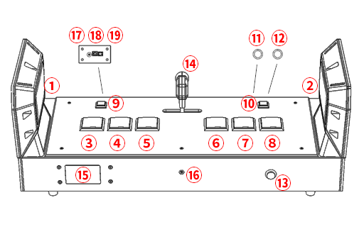

# SimGEKI 2  产品简介

SimGEKI 2 是一款街机风格游戏控制器，使用USB端口同您的游戏设备通信。其具有多个按键和多个RGB灯光组合，带有一个单轴摇杆，内置NFC读卡器，可实现多种游戏控制输入输出模式。

## 硬件信息

### 功能说明

参考以上图像，以下是具体功能说明

| 序号 | 名称       | 功能       |
| ---- | ---------- | ---------- |
| ①    | LSide      | 左侧键     |
| ②    | RSide      | 右侧键     |
| ③    | L1         | 左一号键   |
| ④    | L2         | 左二号键   |
| ⑤    | L3         | 左三号键   |
| ⑥    | R1         | 右一号键   |
| ⑦    | R2         | 右二号键   |
| ⑧    | R3         | 右三号键   |
| ⑨    | LMenu      | 左菜单键   |
| ⑩    | RMenu      | 右菜单键   |
| ⑪    | Test       | 测试键     |
| ⑫    | Service    | 服务键     |
| ⑬    | Coin       | 投币键     |
| ⑭    | Lever      | 摇杆       |
| ⑮    | CardReader | 读卡器     |
| ⑯    | Aux-Out    | 音频输出口 |
| ⑰    | Aux-In     | 音频输入口 |
| ⑱    | USB        | USB-B端口  |
| ⑲    | DC         | DC电源端口 |

### 结构设计

SimGEKI 2 使用一体式铝合金框体打造。上表面覆盖有UV印刷亚克力装饰板材，亚克力装饰板图案为重新绘制的，具有源文档的图像，非公开图像资源。侧键使用2mm钣金冷轧钢板作为基座，根据力学模拟，理论可耐受30kgf冲击力不会出现塑性形变。

### 按键配置

SimGEKI 2 配备了以下规格按键

- 主按键 宝联60mm方形按键
- MENU键 三和24mm方形按键
- Coin,Test和Service按键 宝联24mm圆形按键

另外对于主按键，SimGEKI 2 使用定制的6Pin一体式RGB微动，通过其精心设计的卡扣可以实现轻松拆装及更换，克重更可根据您的需要选配多种规格。

### 侧键和摇杆

侧键和摇杆使用由SimDevices自行设计的结构，侧键内部使用定制弹片提供稳定、统一的回弹力度，配备高性能光电开关提供准确可靠的侧键响应；摇杆使用自研方案，配备定制金属活动件，可使用单个扳手轻松调节摇杆阻尼大小。外观和手感方面，SimGETRO通过多次迭代和测量，高度给您以街机体验的外观及尺寸，在侧键贴纸亦使用重新绘制的，具有源文档的图像，非公开图像资源。

### 外设配置

SimGEKI 2 不但在核心硬件上扎实可靠，更在外设上别出心裁。SimGEKI 2 在基本的游戏控制器外，还配备有独立读卡器；从实际需求出发还配备的后置音频接口和额外供电端口，支持DC 5V-12V输入。另外安全和可靠性也是我们的一直追求的目标，SimGEKI 2 无论是主控制器、读卡器，还是侧键灯板、甚至是前IO面板和后IO面板均使用独立电路板，并根据需求配备ESD保护措施，确保您的设备运行稳定可靠，即使罹遭不幸，也可简易维修和更换。

## 尺寸信息

您可以参考此处列出的尺寸了解设备的占用空间，以便于提前做出合理规划。请注意，这里列出的尺寸仅供参考，实际产品可能和此处展示的尺寸略有差异。

### 框架尺寸

以下尺寸不包含按键凸起、摇杆、侧键以及底部脚垫

- 长 783mm
- 宽 294mm
- 高 105mm

### 整体尺寸

以下尺寸不包含底部脚垫

- 长 795mm
- 宽 309mm
- 高 337mm

### 其他尺寸

- 按键相对于亚克力高度 7mm
- 摇杆相对于亚克力高度 105mm
- 脚垫厚度 11mm
