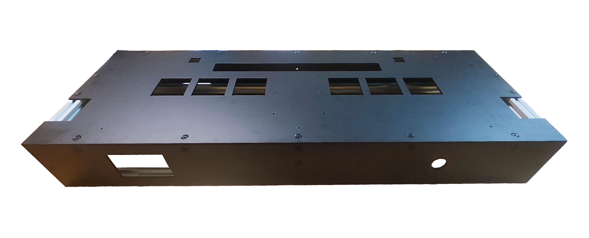

# 框架

## 框架结构

### 材料

SimGETRO设计使用欧标2020铝型材作为框架，使用交叉孔连接紧固。您可以根据以下列出的列表购买材料以组装基本框架。

| 物料         | 规格                        | 数量 |
|------------|---------------------------|----|
| 欧标2020L铝型材 | 743mm 两端攻丝 深度15mm         | 4  |
| 欧标2020L铝型材 | 248mm 两端攻丝 深度15mm         | 4  |
| 欧标2020L铝型材 | 95mm  两端10mm处打M6十字通孔，无需沉孔 | 4  |
| (可选) 弹性扣件  | 欧标2020-M6                 | 16 |
| 半圆头螺丝      | M6X12 头宽10mm 厚2.55mm      | 16 |  

- 使用弹性扣件连接可有效防止型材转动。
- 半圆头螺丝通常与弹性扣件配套销售，若单独购买需注意螺丝头尺寸，以免过大无法装入型材槽。
- **弹性扣件为易损件，建议多备一些以备替换。**

### 型材组装
**如您在 [紧固件](#紧固件) 中使用了滑块螺母搭配限位填充条， 请务必先将填充条和螺母放入槽中再进行组装！**

1. 将半圆头螺丝预装至型材两端的螺纹孔上， 然后将型材如动画所示滑入槽中，最后通过通孔将螺丝拧紧固定。  
     
   如您使用了弹性扣件，请一并预装至两端的螺纹孔上。  
   
2. 将所有型材如法炮制，框架安装完毕。

## 箱体面板
SimGETRO所使用的金属及亚克力面板您可以在 [SimDevices官方QQ群](https://qm.qq.com/q/r6NhmKxq7e) 中下载和获取图纸。
根据图纸要求加工即可。
### 面板材料

| 物料         | 规格           | 数量 |
|------------|--------------|----|
| 顶面固定板      | 3mm厚铝板       | 1  |
| 前面板        | 3mm厚黑色喷砂铝板   | 1  |
| 后面板        | 3mm厚黑色喷砂铝板   | 1  |
| 侧键固定板      | 3mm厚碳钢板      | 2  |
| 底面板   | 2mm厚铝板       | 1 |
| 侧键装饰板 | 3mm厚哑光黑色亚克力  | 2 |
| 顶面装饰板      | 5mm厚亚克力带UV喷绘 | 1 |  
**其中： 两块侧键固定板、两块侧键装饰板互为镜像，需将沉头孔打在不同的两侧。 侧键装饰亚克力板需倒角3mm。 顶面装饰亚克力板6个螺丝孔做3mm台阶孔，其余处倒角3mm。**  
金属面板的孔位工艺均已标注在图纸文件中。

### 紧固件

您可以使用滑块螺母搭配限位填充条的方式进行紧固件的放置。  
若使用弹珠螺母/弹片螺母直接卡入型材放置，则无需打印填充条，并可预先将型材框架组装好。

| 物料                 | 规格   | 数量 |
|--------------------|------|----|
| 滑块螺母 / 弹珠螺母 / 弹片螺母 | 欧标2020 | 70 |
| 黑色沉头内六角螺丝          | M4X8 | 60 |
| 内六角半圆头(镀铬)螺丝 | M4X8 | 6  |
| 圆头十字/圆头内六角螺丝 | M4X12 | 6  |
| 橡胶脚垫 | 20*16*10.5 | 6 |

#### (可选) 限位填充条的3D打印件

1. 您可以从以下网站下载用于组装框架的3D打印件，这些打印件将用于为滑块螺母限位，使其基本固定，但在小范围可活动。

- [MakerWorld中国大陆区](https://makerworld.com.cn/zh/models/655698)
- [MakerWorld国际区](https://makerworld.com/zh/models/801788)

2. 请根据打印文件打印对应数量的打印件，在打印完毕后，您将会拥有以下类型和数量的打印件。

| 物料   | 规格    | 数量 |
| ------ | ------- | ---- |
| 填充条 | 243mm   | 8    |
| 填充条 | 233.5mm | 8    |
| 填充条 | 249.5mm | 8    |
| 填充条 | 53.4mm  | 8    |
| 填充条 | 103.4mm | 4    |
| 填充条 | 119.4mm | 8    |
| 填充条 | 216mm   | 2    |  

3. 根据以下配对方式，将所有填充条同滑块螺母一并塞入铝型材框架中

| 型材    | 填充方式                                                                                                                                                                                                                               |
|-------| -------------------------------------------------------------------------------------------------------------------------------------------------------------------------------------------------------------------------------------- |
| 743mm | 使用一根243mm填充条配合两根233.5mm填充条填充铝型材四个面中的一个，请注意，填充条中的三角形指向型材中心位置；然后使用一根243mm填充条配合两根249.5mm填充条填充任意相邻的一面。依此法填充全部4根型材。                                    |
| 248mm | 使用一根216mm填充条填充铝型材四个面中的一个，然后使用两根119.4mm填充条夹一颗滑块螺母一并填充相邻的一面，再以此法镜像填充另一根铝型材。剩余两根型材使用两根119.4mm填充条夹一颗滑块螺母配合两根103.4mm填充条夹一颗滑块螺母填充完毕即可。 |
| 95mm  | 使用53.4mm填充条填充相邻的两个面即可，请注意箭头方向要一致，在安装时请使箭头指向顶部。                                                                                                                                                 |

4. 在填充完毕所有填充条后，按照 [型材组装](#型材组装) 中的方式安装即可。

### 面板安装

#### 将面板固定至铝型材上
1. 若使用 **滑块螺母** ，请确保螺母均已放置在型材槽中。  
   若使用 **弹片螺母/弹珠螺母** ，请将螺母放置入型材中，带有弹性的螺母可以卡在型材槽中不会位移，对准各个金属面板的孔位。
2. 将面板的螺孔对准螺母，使用 **M4X8黑色沉头内六角螺丝** 拧入螺孔，旋紧即可完成安装。
3. 将 **橡胶脚垫** 和 **M4X12圆头螺丝** 安装在底板上。  

效果如图 (图中侧面板未安装)     

#### 将装饰板固定至金属面板上
- 使用 **M4X8黑色沉头内六角螺丝** 将左右侧键装饰板拧至左右侧键固定板上。
- 使用 **M4X8(镀铬)内六角半圆头螺丝** 将顶面装饰板固定至顶面固定板上。